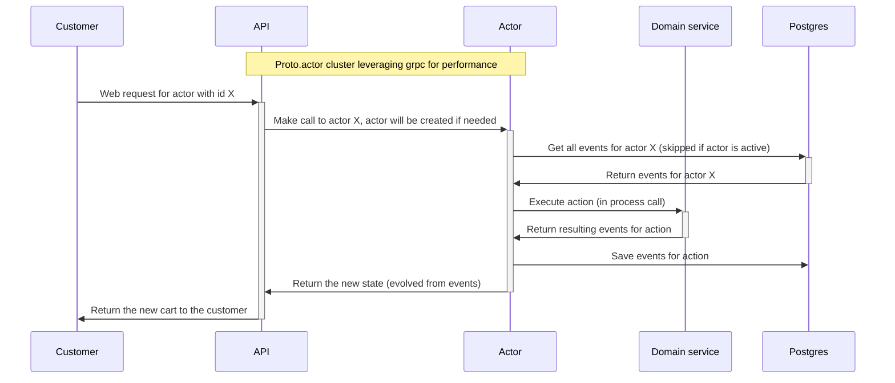

# Sample cart/basket solution

Experimental project showcasing a high performance cart solution using [MartenDB](https://martendb.io/) for event sourcing, and [proto.actor](https://proto.actor/) for scalability and resiliency.

The idea is that any customer will create a cart, this cart will be stored using events in the db, and the state will be stored in memory in an actor. If an actor times out or crashes, the events for that cart will be read on the next request and state will be stored. An approach like this will minimize the load on the database since the data can be served from memory for "active" carts. Interaction with the database is needed in only when 

1. An actor starts, then all events for that actor is read.
2. An action has been made, then the events resulting from the action needs to be stored.

## Graphical representation of the application

The above diagram can look like multiple different applications, but it is only two and they are in the same repo and deployed together. The two applications are:

* API - this is the application the customer talks with.
* Service - This is the internal proto.actor cluster that the API calls to and what hosts all the actors.

The separation of the two definitely increase complexity, but it does increase resiliency. With this configuration a service pod (will be hosted in kubernetes) can completely crash, and after a retry from the web to the service the exact same actor would be recreated on another node in the same cluster. If I had the actors running in the same application as the web app a failure in an actor would potentially fail the complete request or take down the web app.

